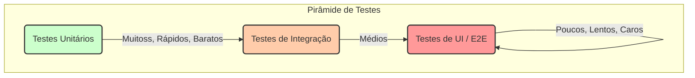

# 🧪 Testes de Software: Garantindo a Qualidade e a Confiança

**Testes de Software** são um processo de verificação e validação para garantir que um sistema de software atenda aos requisitos técnicos e de negócio, funcionando conforme o esperado e livre de defeitos. É uma disciplina fundamental na engenharia de software, crucial para entregar produtos de alta qualidade.

Longe de ser apenas uma "caça a bugs", uma boa estratégia de testes serve como uma rede de segurança que permite que as equipes de desenvolvimento façam alterações, refatorem o código e adicionem novas funcionalidades com a confiança de que não estão quebrando o que já existia.

### Por Que os Testes São Cruciais?

  - **Garantia da Qualidade**: Identifica bugs e falhas antes que o software chegue ao usuário final.
  - **Aumento da Confiança**: Permite que os desenvolvedores refatorem e melhorem o código com segurança.
  - **Prevenção de Regressões**: Garante que novas funcionalidades não quebrem as antigas.
  - **Documentação Viva**: Testes bem escritos servem como uma documentação executável que descreve como o sistema deve se comportar.
  - **Facilita a Manutenção**: Código testável tende a ser mais modular, desacoplado e fácil de entender.

-----

## 🔺 A Pirâmide de Testes: Uma Estratégia Visual

A Pirâmide de Testes é um modelo mental que ajuda a estruturar uma estratégia de testes de forma eficiente. A ideia é ter muitos testes rápidos e baratos na base, e poucos testes lentos e caros no topo.



-----

## 🔬 Níveis de Teste: Da Unidade ao Todo

Cada camada da pirâmide corresponde a um tipo de teste com escopo e objetivo diferentes.

### 1\. Testes Unitários (Unit Tests)

São a base da pirâmide. Eles verificam a menor parte testável de uma aplicação (uma função, método ou classe) de forma **totalmente isolada** do resto do sistema.

  - **Escopo**: Uma única unidade de código.
  - **Objetivo**: Garantir que a lógica interna daquela unidade está correta.
  - **Características**: São extremamente rápidos de executar, fáceis de escrever e devem compor a grande maioria dos testes do projeto.
  - **Isolamento**: Dependências externas (como banco de dados, APIs ou outras classes) são substituídas por "dublês de teste" como **Mocks** ou **Stubs** para garantir que apenas a unidade em questão está sendo testada.

<!-- end list -->

```pseudocode
// Código a ser testado
function Calculadora.somar(a, b) {
    return a + b;
}

// Teste Unitário
test "A função somar deve retornar a soma de dois números" {
    resultado = Calculadora.somar(2, 3);
    assert_equals(resultado, 5);
}
```

### 2\. Testes de Integração (Integration Tests)

Estão no meio da pirâmide. Eles verificam se diferentes unidades, módulos ou serviços do sistema funcionam corretamente quando **combinados**.

  - **Escopo**: A interação entre dois ou mais componentes.
  - **Objetivo**: Detectar falhas na comunicação entre as partes do sistema (ex: a aplicação consegue gravar e ler dados do banco de dados? A API responde corretamente?).
  - **Características**: São mais lentos que os testes unitários, pois podem envolver o sistema de arquivos, a rede ou um banco de dados real.

<!-- end list -->

```pseudocode
// Teste de Integração
test "O serviço de usuário deve salvar um novo usuário no banco de dados" {
    servicoUsuario = new ServicoUsuario(conexao_banco_de_dados_real);
    
    // Ação
    novoUsuario = servicoUsuario.criar("Ana", "ana@email.com");
    
    // Verificação
    usuarioDoBanco = banco_de_dados_real.buscarPorId(novoUsuario.id);
    assert_not_null(usuarioDoBanco);
    assert_equals(usuarioDoBanco.nome, "Ana");
}
```

### 3\. Testes de Ponta a Ponta (End-to-End - E2E Tests)

Estão no topo da pirâmide. Eles simulam a jornada completa de um usuário real na aplicação, testando o sistema como um todo.

  - **Escopo**: O fluxo completo da aplicação, da interface do usuário (UI) até o banco de dados e de volta.
  - **Objetivo**: Validar que o sistema atende aos requisitos de negócio e que os fluxos de usuário funcionam como esperado.
  - **Características**: São os mais lentos, mais caros de manter e mais frágeis (podem quebrar facilmente com pequenas mudanças na UI). Por isso, devem ser escritos em menor quantidade, focando nos "caminhos felizes" e nos fluxos mais críticos.
  - **Ferramentas Comuns**: Cypress, Selenium, Playwright.

<!-- end list -->

```pseudocode
// Teste End-to-End
test "Usuário deve conseguir fazer login e ver seu painel" {
    // 1. Navega para a página de login
    browser.visit("/login");

    // 2. Preenche o formulário
    browser.fill("email", "usuario@teste.com");
    browser.fill("senha", "senha123");

    // 3. Clica no botão de entrar
    browser.click("Entrar");

    // 4. Verifica se foi redirecionado e se o nome do usuário aparece na tela
    assert_current_path("/painel");
    assert_text_present("Bem-vindo, Usuário!");
}
```

-----

## 💡 Abordagens e Metodologias de Teste

### Test-Driven Development (TDD) - Desenvolvimento Guiado por Testes

É um ciclo de desenvolvimento onde os testes são escritos *antes* do código de produção. O fluxo é:

1.  **Red**: Escrever um teste que falha, pois a funcionalidade ainda não existe.
2.  **Green**: Escrever a menor quantidade de código possível para fazer o teste passar.
3.  **Refactor**: Melhorar o código de produção sem alterar seu comportamento (e garantindo que os testes continuem passando).

### Behavior-Driven Development (BDD) - Desenvolvimento Guiado por Comportamento

É uma evolução do TDD que foca em descrever o comportamento do sistema de uma forma que seja compreensível para pessoas de negócio, analistas e desenvolvedores. Utiliza uma linguagem natural, geralmente no formato **Given-When-Then** (Dado-Quando-Então).

```gherkin
Funcionalidade: Login de Usuário

Cenário: Login com credenciais válidas
  Dado que eu estou na página de login
  Quando eu preencho o campo "email" com "usuario@teste.com"
  E eu preencho o campo "senha" com "senha123"
  E eu clico no botão "Entrar"
  Então eu devo ser redirecionado para a página "/painel"
```

-----

## 📋 Outros Tipos de Teste Importantes

  - **Testes de Regressão**: Conjunto de testes executados para garantir que as alterações recentes no código não introduziram novos bugs em funcionalidades que já existiam.
  - **Testes de Performance (Carga e Estresse)**: Avaliam como o sistema se comporta sob uma grande quantidade de usuários ou dados, medindo tempos de resposta, uso de memória e CPU.
  - **Testes de Segurança**: Focam em encontrar vulnerabilidades e garantir que o sistema esteja protegido contra ataques maliciosos.
  - **Testes de Usabilidade**: Envolvem usuários reais para avaliar se a aplicação é fácil, intuitiva e agradável de usar.