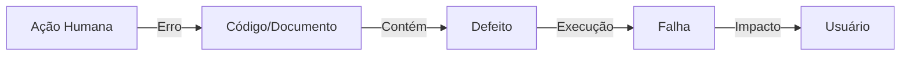

# Aula 01 - Qualidade de Software e Papel do QA 🧐

## 🧠 Conceitos de Qualidade

A qualidade de software não é apenas a ausência de bugs, mas a conformidade com os requisitos e a satisfação do usuário final. De acordo com a **ISO/IEC 25010**, a qualidade é dividida em características como adequação funcional, eficiência de desempenho, usabilidade, entre outras.

> [!NOTE]
> **Conceito**: Qualidade é o grau no qual um conjunto de características inerentes satisfaz a requisitos.

---

## ⚠️ Erro, Defeito e Falha

É fundamental entender a cadeia de causalidade em QA:

1.  **Erro**: Uma ação humana que produz um resultado incorreto (ex: erro de lógica durante a codificação).
2.  **Defeito (Bug)**: A manifestação do erro no artefato (código, documento).
3.  **Falha**: O desvio do comportamento esperado durante a execução (o sistema "quebra" ou retorna valor errado).

### Fluxo de Causalidade

---

## 🔍 Verificação x Validação

*   **Verificação**: "Estamos construindo o produto corretamente?" (Foco no processo: revisões, inspeções, análise estática).
*   **Validação**: "Estamos construindo o produto correto?" (Foco no produto: testes de execução contra requisitos do usuário).

---

## 💻 Visão Geral dos Testes

Vamos ver como um QA interage com o terminal para realizar uma verificação básica de ambiente.

    npm --version
    
    10.2.4
    git status
    No branch main. Your branch is up to date.
    python --version
    Python 3.11.5

---

## 📝 Exercício de Fixação

1.  **Explique** com suas palavras a diferença entre um Erro e uma Falha.
2.  **Dê um exemplo** de uma atividade de Verificação que não envolva a execução do código.

---

## 🚀 Mini-Projeto

**Objetivo**: Identificar falhas em um site simples.
- Escolha um site de livre acesso.
- Tente realizar 3 fluxos diferentes (ex: busca, login, adicionar ao carrinho).
- Documente se houve alguma **Falha** ou se o comportamento foi o esperado (**Sucesso**).

---

## 🔗 Materiais da Aula

- :material-presentation: **Slides**
    ---
    Material visual com diagramas e conceitos-chave.
    [:octicons-arrow-right-24: Slide 01](../slides/slide-01.md)

- :material-help-circle: **Quiz**
    ---
    Teste seu conhecimento com 10 questões interativas.
    [:octicons-arrow-right-24: Quiz 01](../quizzes/quiz-01.md)

- :fontawesome-solid-pencil: **Exercícios**
    ---
    5 exercícios progressivos (básico → desafio).
    [:octicons-arrow-right-24: Exercício 01](../exercicios/exercicio-01.md)

- :material-briefcase-outline: **Projeto**
    ---
    Aplicação prática dos conceitos da aula.
    [:octicons-arrow-right-24: Projeto 01](../projetos/projeto-01.md)

---

[➡️ Próxima Aula: Aula 02](./aula-02.md){ .md-button .md-button--primary }
