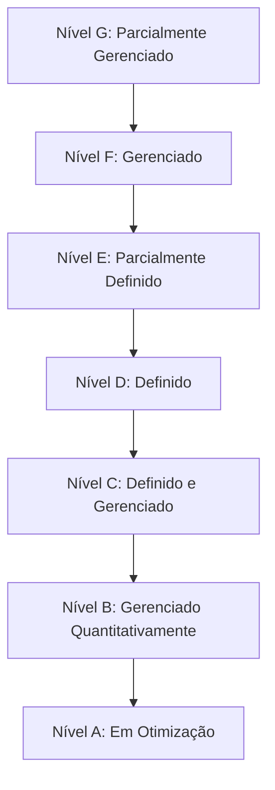

# Aula 02 - Modelos de Qualidade de Software 📊

## 🏛️ Modelos de Referência

Para garantir que uma empresa produz software com qualidade, existem modelos que avaliam a **maturidade** dos processos. Os dois principais no Brasil são o **CMMI** e o **MPS.br**.

### CMMI (Capability Maturity Model Integration)
O CMMI é um modelo global que foca na melhoria de processos em organizações de diferentes tamanhos. Ele possui 5 níveis de maturidade:

1.  **Inicial**: Processos imprevisíveis e reativos.
2.  **Gerenciado**: Processos caracterizados para projetos (foco em gestão).
3.  **Definido**: Processos padrões para toda a organização.
4.  **Gerenciado Quantitativamente**: Processos medidos e controlados.
5.  **Em Otimização**: Foco na melhoria contínua dos processos.

---

## 🇧🇷 MPS.br (Melhoria de Processo do Software Brasileiro)

Criado pela SOFTEX, o MPS.br é um modelo mais acessível para pequenas e médias empresas brasileiras. Ele possui 7 níveis de maturidade (de G até A):

---

## 📈 Métricas de Defeitos

Qualidade sem medição é apenas opinião. Algumas métricas essenciais:

*   **Densidade de Defeitos**: Número de defeitos / Tamanho do software (ex: KLOC).
*   **Eficiência de Remoção de Defeitos (DRE)**: Quantos defeitos foram encontrados antes do lançamento vs. após.

---

## 💻 Verificando Status de Maturity no Projeto

    git log --oneline | wc -l
    152 (Número de commits para rastreabilidade)
    pytest --version
    pytest 7.4.0

---

## 📝 Exercício de Fixação

1.  Qual o nível de maturidade do CMMI onde os processos passam a ser **medidos quantitativamente**?
2.  Por que o MPS.br é considerado mais adequado para PMEs brasileiras em comparação ao CMMI?

---

## 🚀 Mini-Projeto

**Objetivo**: Analisar um processo fictício.
- Imagine uma empresa que não documenta nada e os prazos nunca são cumpridos.
- Em qual nível do CMMI ela estaria?
- Liste 3 ações imediatas para levá-la ao **Nível 2**.

---

## 🔗 Materiais da Aula

- :material-presentation: **Slides**
    ---
    Material visual com diagramas e conceitos-chave.
    [:octicons-arrow-right-24: Slide 02](../slides/slide-02.md)

- :material-help-circle: **Quiz**
    ---
    Teste seu conhecimento com 10 questões interativas.
    [:octicons-arrow-right-24: Quiz 02](../quizzes/quiz-02.md)

- :fontawesome-solid-pencil: **Exercícios**
    ---
    5 exercícios progressivos (básico → desafio).
    [:octicons-arrow-right-24: Exercício 02](../exercicios/exercicio-02.md)

- :material-briefcase-outline: **Projeto**
    ---
    Aplicação prática dos conceitos da aula.
    [:octicons-arrow-right-24: Projeto 02](../projetos/projeto-02.md)

---

[➡️ Próxima Aula: Aula 03](./aula-03.md){ .md-button .md-button--primary }
