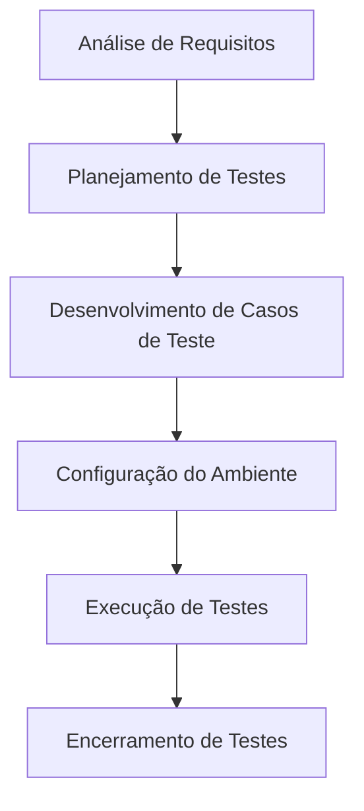

# Aula 03 - Ciclo de Vida de Testes (STLC) 🔄

## ⚙️ O que é STLC?

O **STLC (Software Testing Life Cycle)** é uma sequência de atividades específicas realizadas durante o processo de teste para garantir que os objetivos de qualidade do software sejam atendidos.

Diferente do SDLC (Desenvolvimento), o STLC foca exclusivamente nas fases de teste.

---

## 🗺️ Fases do STLC

### Detalhamento das Fases:
1.  **Análise de Requisitos**: O que será testado? (Funcionalidades, performance).
2.  **Planejamento**: Estimativa de tempo, recursos e ferramentas.
3.  **Casos de Teste**: Criação dos passos e dados de entrada.
4.  **Ambiente**: Setup do hardware/software (QA environment).
5.  **Execução**: Rodar os testes e reportar bugs.
6.  **Encerramento**: Relatório final e lições aprendidas.

---

## ⚖️ STLC vs SDLC

| Fase SDLC | Fase STLC Correspondente |
| :--- | :--- |
| Requisitos | Análise de Requisitos de Teste |
| Design | Planejamento e Design de Testes |
| Codificação | Desenvolvimento de Casos de Teste |
| Testes | Execução e Report |
| Manutenção | Testes de Regressão |

---

## 💻 Simulação de Configuração de Ambiente

    mkdir test-environment
    cd test-environment
    docker pull qa-image:latest
    
    Ambiente QA pronto para execução.

---

## 📝 Exercício de Fixação

1.  Em qual fase do STLC são definidos os **Critérios de Aceite**?
2.  Por que é importante configurar o ambiente de teste de forma isolada do ambiente de desenvolvimento?

---

## 🚀 Mini-Projeto

**Objetivo**: Mapear as fases de um teste simples.
- Cenário: Testar o botão "Esqueci minha senha" de um sistema.
- Descreva o que você faria em cada uma das **6 fases do STLC** para esse cenário.

---

## 🔗 Materiais da Aula

- :material-presentation: **Slides**
    ---
    Material visual com diagramas e conceitos-chave.
    [:octicons-arrow-right-24: Slide 03](../slides/slide-03.html)

- :material-help-circle: **Quiz**
    ---
    Teste seu conhecimento com 10 questões interativas.
    [:octicons-arrow-right-24: Quiz 03](../quizzes/quiz-03.md)

- :fontawesome-solid-pencil: **Exercícios**
    ---
    5 exercícios progressivos (básico → desafio).
    [:octicons-arrow-right-24: Exercício 03](../exercicios/exercicio-03.md)

- :material-briefcase-outline: **Projeto**
    ---
    Aplicação prática dos conceitos da aula.
    [:octicons-arrow-right-24: Projeto 03](../projetos/projeto-03.md)

---

[➡️ Próxima Aula: Aula 04](./aula-04.md){ .md-button .md-button--primary }
