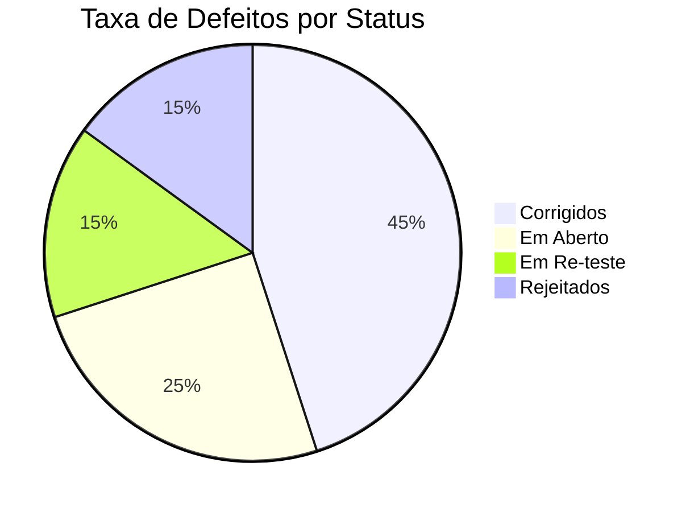

# Aula 04 - Documentação e Controle de Testes 📄

## 📑 A Importância da Documentação

Testar sem documentar é apenas "brincar" com o software. A documentação garante a **rastreabilidade**, **repetibilidade** e serve como evidência para auditorias.

> [!IMPORTANT]
> Se não foi documentado, o teste não foi feito!

---

## 🛠️ Principais Artefatos

### 1. Plano de Testes
Documento de alto nível que descreve a estratégia, o escopo, os recursos e o cronograma das atividades de teste.

### 2. Caso de Teste (Test Case)
Um conjunto de condições ou variáveis sob as quais um testador determinará se um sistema funciona corretamente.

**Exemplo de Caso de Teste:**
| ID | Descrição | Pré-condição | Passos | Resultado Esperado |
| :--- | :--- | :--- | :--- | :--- |
| CT-01 | Login com Sucesso | Usuário cadastrado | 1. Inserir email correto 2. Inserir senha correta 3. Clicar em Entrar | Redirecionamento para a Home |

### 3. Relatório de Bugs (Bug Report)
Documento que detalha um defeito encontrado. Deve conter:
- Título claro
- Passos para reproduzir
- Resultado atual vs. Resultado esperado
- Severidade e Prioridade

---

## 📊 Indicadores (Métricas)

---

## 💻 Verificando Cobertura de Logs

    cat logs/test-execution.log | grep "FAILED"
    ERROR: CT-05 Falhou - Timeout ao carregar checkout
    ls docs/test-cases/*.xlsx
    casos_de_teste_v1.xlsx

---

## 📝 Exercício de Fixação

1.  Qual a diferença entre um **Cenário de Teste** e um **Caso de Teste**?
2.  Imagine que você encontrou um erro ortográfico em um botão. Qual seria a **Severidade** e a **Prioridade** desse bug?

---

## 🚀 Mini-Projeto

**Objetivo**: Escrever seu primeiro relatório de bug.
- Acesse um aplicativo qualquer.
- Identifique um comportamento estranho ou um erro real.
- Escreva um **Bug Report** completo seguindo a estrutura vista em aula.
