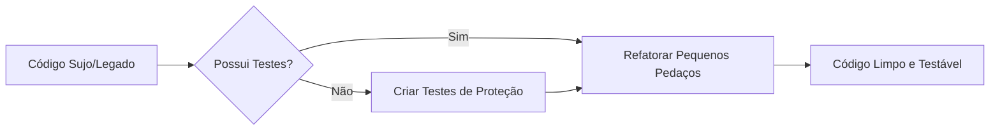

# Aula 05 - Melhores Práticas de Programação ✨

## 🧹 Introdução ao Clean Code

Escrever código que funciona é fácil; difícil é escrever código que outros (e você mesmo no futuro) consigam entender e testar. O **Clean Code** (Código Limpo) é a base de um software com alta qualidade.

> [!TIP]
> Código limpo deve ser lido como uma prosa bem escrita.

---

## 🏗️ Princípios para Testabilidade

Para que um software seja facilmente testado, ele deve seguir alguns princípios:

1.  **Nomes Significativos**: Variáveis e funções devem dizer a que vieram. 
    - ❌ `v = 10`
    - ✅ `max_retry_attempts = 10`
2.  **Funções Pequenas**: Uma função deve fazer apenas uma coisa.
3.  **DRY (Don't Repeat Yourself)**: Evite duplicidade de código para não ter que atualizar testes em múltiplos lugares.
4.  **KISS (Keep It Simple, Stupid)**: Evite complexidade desnecessária.

---

## 🛠️ Refatoração

Refatorar é o processo de melhorar a estrutura interna do código sem alterar seu comportamento externo. No contexto de QA, refatoramos para:
- Remover código "cheiroso" (**Code Smells**).
- Facilitar a criação de testes unitários.



---

## 💻 Refatoração na Prática (Terminal)

<div id="termynal" data-termynal>
    <span data-ty="input">git diff main -- stat</span>
    <span data-ty>utils.py | 45 +++---</span>
    <span data-ty="input">pytest utils.py</span>
    <span data-ty="progress"></span>
    <span data-ty>15 passed in 0.05s (Refatoração validada!)</span>
</div>

---

## 📝 Exercício de Fixação

1.  O que é um **Code Smell**? Cite um exemplo comum.
2.  Por que a regra do "Escoteiro" (*Deixe o código sempre um pouco mais limpo do que você o encontrou*) é importante para a qualidade?

---

## 🚀 Mini-Projeto

**Objetivo**: Identificar e limpar um trecho de código.
- Abaixo está um código "sujo":
```python
def p(a, b):
    x = 0
    for i in range(len(a)):
        x += a[i] * b
    return x
```
- **Tarefa**: Reescreva este código seguindo os princípios de Nomes Significativos e Simplicidade.

---

## 🔗 Materiais da Aula

<div class="grid cards" markdown>

- :material-presentation: **Slides**
    ---
    Material visual com diagramas e conceitos-chave.
    [:octicons-arrow-right-24: Slide 05](../slides/slide-05.html)

- :material-help-circle: **Quiz**
    ---
    Teste seu conhecimento com 10 questões interativas.
    [:octicons-arrow-right-24: Quiz 05](../quizzes/quiz-05.md)

- :fontawesome-solid-pencil: **Exercícios**
    ---
    5 exercícios progressivos (básico → desafio).
    [:octicons-arrow-right-24: Exercício 05](../exercicios/exercicio-05.md)

- :material-briefcase-outline: **Projeto**
    ---
    Aplicação prática dos conceitos da aula.
    [:octicons-arrow-right-24: Projeto 05](../projetos/projeto-05.md)

</div>

---

[➡️ Próxima Aula: Aula 06](./aula-06.md){ .md-button .md-button--primary }
