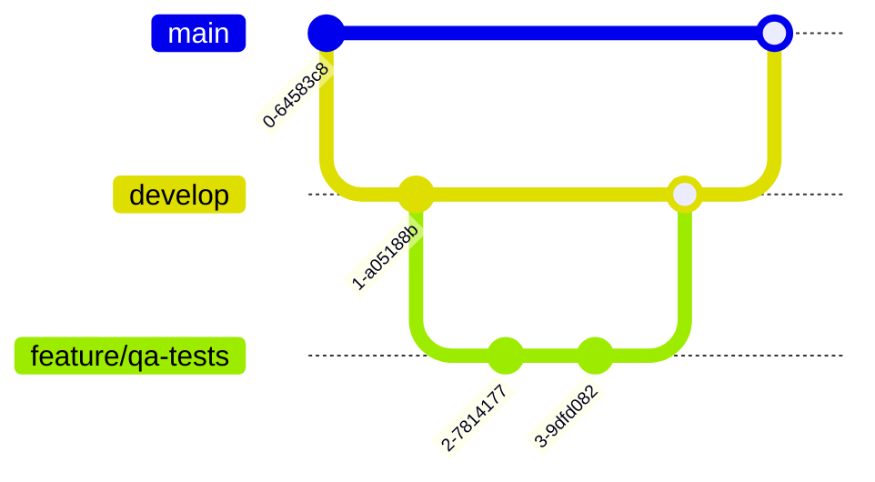

# Aula 06 - Controle de Versão e CI 🐙

## 🌿 Versionamento com Git

O controle de versão é o alicerce de qualquer projeto de software moderno. Para o QA, entender Git é essencial para:
- Testar branches específicas antes do merge.
- Rastrear em qual commit um bug foi introduzido (`git bisect`).
- Garantir que a versão testada é a mesma que irá para produção.

### Fluxo Básico de Branches

---

## 🚀 Integração Contínua (CI)

A **Integração Contínua** é a prática de integrar o código em um repositório compartilhado várias vezes ao dia, onde cada integração é verificada por um **build automatizado** e **testes**.

> [!IMPORTANT]
> O objetivo do CI é encontrar erros o mais rápido possível (**Fail Fast**).

### Componentes de um Pipeline de CI:
1.  **Trigger**: Evento que inicia o processo (ex: Push no GitHub).
2.  **Build**: Compilação do código.
3.  **Test**: Execução de testes unitários e de integração.
4.  **Result**: Notificação de sucesso ou falha.

---

## 💻 Executando uma Pipeline Localmente

    git checkout -b fix/login-issue
    git commit -m "Fix login validation bug"
    git push origin fix/login-issue
    
    GitHub Actions: Running CI Pipeline...
    ✅ Build Success | ✅ Tests Passed

---

## 📝 Exercício de Fixação

1.  Qual a vantagem de usar o comando `git branch` para realizar testes?
2.  O que acontece se uma etapa de teste falhar dentro de uma pipeline de CI?

---

## 🚀 Mini-Projeto

**Objetivo**: Configurar um "CI manual".
- Crie uma pasta local.
- Crie um script shell (ou .bat) que:
  1. Liste os arquivos da pasta.
  2. Tente executar um comando de teste fictício (ex: `python -m unittest`).
  3. Salve o resultado em um arquivo `resultado_ci.txt`.
- Simule uma falha e veja o registro no log.

---

## 🔗 Materiais da Aula

- :material-presentation: **Slides**
    ---
    Material visual com diagramas e conceitos-chave.
    [:octicons-arrow-right-24: Slide 06](../slides/slide-06.md)

- :material-help-circle: **Quiz**
    ---
    Teste seu conhecimento com 10 questões interativas.
    [:octicons-arrow-right-24: Quiz 06](../quizzes/quiz-06.md)

- :fontawesome-solid-pencil: **Exercícios**
    ---
    5 exercícios progressivos (básico → desafio).
    [:octicons-arrow-right-24: Exercício 06](../exercicios/exercicio-06.md)

- :material-briefcase-outline: **Projeto**
    ---
    Aplicação prática dos conceitos da aula.
    [:octicons-arrow-right-24: Projeto 06](../projetos/projeto-06.md)

---

[➡️ Próxima Aula: Aula 07](./aula-07.md){ .md-button .md-button--primary }
