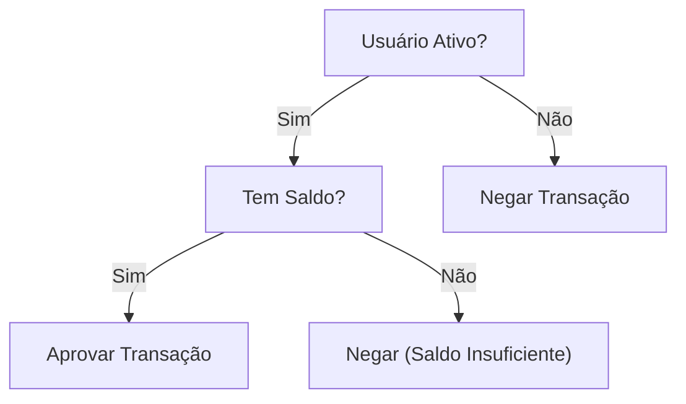

# Aula 07 - Técnicas de Teste: Caixa Preta 🌑

## 📦 O que é Teste de Caixa Preta?

Os testes de caixa preta focam nos **requisitos funcionais** do software. O testador não tem acesso ao código interno; ele se baseia apenas nas entradas e saídas esperadas.

> [!NOTE]
> Também conhecido como teste baseado na especificação.

---

## 🎯 Técnicas Principais

### 1. Partição de Equivalência
Divide os dados de entrada em conjuntos que devem ser processados da mesma forma. Testamos apenas um valor de cada conjunto.

**Exemplo**: Campo "Idade" (1 a 120 anos)
- Set 1: Menores que 1 (Inválido)
- Set 2: 1 a 120 (Válido)
- Set 3: Maiores que 120 (Inválido)

### 2. Análise de Valor Limite
Foca nas "bordas" das partições, onde a maioria dos erros ocorre.

**Exemplo** (Idade 1 a 120):
- Testar: 0, 1, 2, 119, 120, 121.

### 3. Tabela de Decisão
Usada quando diferentes combinações de entradas resultam em diferentes ações.

---

## 💻 Simulando Entradas de Caixa Preta

    python validator.py --age 0
    ERROR: Idade mínima é 1. (Validado Limite Inferior)
    python validator.py --age 60
    SUCCESS: Acesso permitido. (Validado Equivalência)
    python validator.py --age 121
    ERROR: Idade máxima é 120. (Validado Limite Superior)

---

## 📝 Exercício de Fixação

1.  Um campo de senha aceita de 8 a 16 caracteres. Quais valores você escolheria para uma **Análise de Valor Limite**?
2.  Por que a Partição de Equivalência ajuda a reduzir o tempo total de execução dos testes?

---

## 🚀 Mini-Projeto

**Objetivo**: Aplicar técnicas de caixa preta.
- Cenário: Um sistema de e-commerce dá 10% de desconto para compras acima de R$ 500,00 e frete grátis para compras acima de R$ 1.000,00.
- **Tarefa**: Crie uma pequena tabela com 5 casos de teste que cubram a **Partição de Equivalência** e os **Valores Limite** desta regra.

---

## 🔗 Materiais da Aula

- :material-presentation: **Slides**
    ---
    Material visual com diagramas e conceitos-chave.
    [:octicons-arrow-right-24: Slide 07](../slides/slide-07.html)

- :material-help-circle: **Quiz**
    ---
    Teste seu conhecimento com 10 questões interativas.
    [:octicons-arrow-right-24: Quiz 07](../quizzes/quiz-07.md)

- :fontawesome-solid-pencil: **Exercícios**
    ---
    5 exercícios progressivos (básico → desafio).
    [:octicons-arrow-right-24: Exercício 07](../exercicios/exercicio-07.md)

- :material-briefcase-outline: **Projeto**
    ---
    Aplicação prática dos conceitos da aula.
    [:octicons-arrow-right-24: Projeto 07](../projetos/projeto-07.md)

---

[➡️ Próxima Aula: Aula 08](./aula-08.md){ .md-button .md-button--primary }
