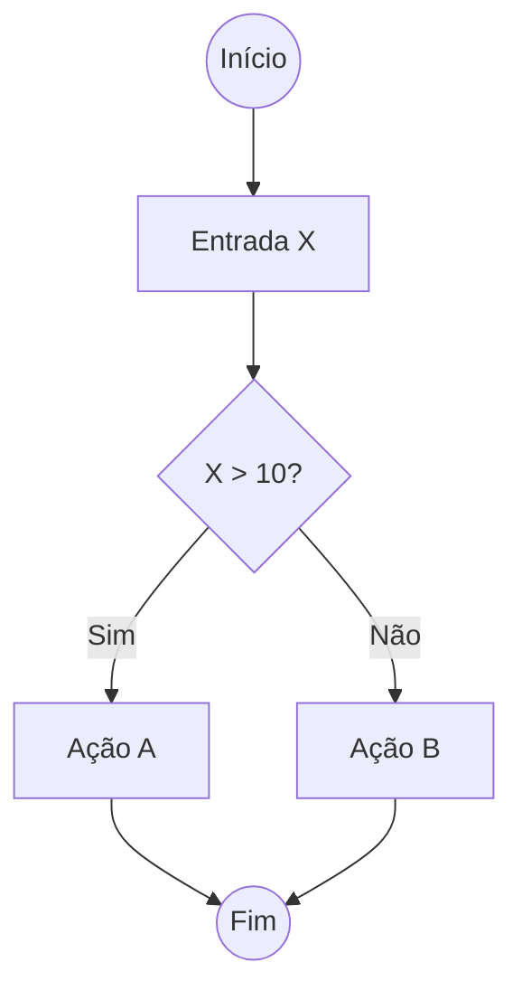

# Aula 08 - Técnicas de Teste: Caixa Branca ⚪

## 🔍 O que é Teste de Caixa Branca?

Ao contrário da caixa preta, os testes de caixa branca (ou teste estrutural) permitem que o testador olhe para o **interior do código**. O objetivo é verificar a estrutura lógica, caminhos, fluxos de controle e condições.

> [!NOTE]
> Foco na implementação e na eficiência do algoritmo.

---

## 🏗️ Técnicas Principais

### 1. Cobertura de Código (Code Coverage)
Mede o percentual do código que é executado pelos testes. Existem sub-níveis:
- **Cobertura de Instruções**: Cada linha de código foi executada?
- **Cobertura de Decisões/Caminhos**: Todos os `if/else` foram percorridos em ambas as direções?

### 2. Fluxo de Controle
Utiliza grafos para representar a lógica do programa e identificar caminhos que podem não estar sendo testados.



### 3. Teste de Fluxo de Dados
Foca no ciclo de vida das variáveis (onde são declaradas, usadas e destruídas).

---

## 📊 Cobertura na Prática

Muitas ferramentas geram relatórios automáticos de cobertura (ex: `coverage.py`, `Istanbul`, `Jacoco`).

<div id="termynal" data-termynal>
    <span data-ty="input">pytest --cov=app tests/</span>
    <span data-ty="progress"></span>
    <span data-ty>----------- coverage: platform win32 -----------</span>
    <span data-ty>Name           Stmts   Miss  Cover</span>
    <span data-ty>app/auth.py       50      5    90%</span>
    <span data-ty>app/db.py         30     15    50% (Atenção aqui!)</span>
</div>

---

## 📝 Exercício de Fixação

1.  Se um código possui 100% de **Cobertura de Instruções**, ele está livre de erros de lógica? Justifique.
2.  Qual a principal diferença entre um teste de **Caminho** e um teste de **Decisão**?

---

## 🚀 Mini-Projeto

**Objetivo**: Desenhar um fluxo de controle.
- Abaixo está um pseudocódigo:
```
LEIA temperatura
SE temperatura > 30:
    EXIBA "Quente"
SENÃO SE temperatura < 15:
    EXIBA "Frio"
SENÃO:
    EXIBA "Agradável"
```
- **Tarefa**: Desenhe o **Grafo de Fluxo de Controle** para este código e identifique quantos casos de teste são necessários para garantir 100% de cobertura de decisões.
