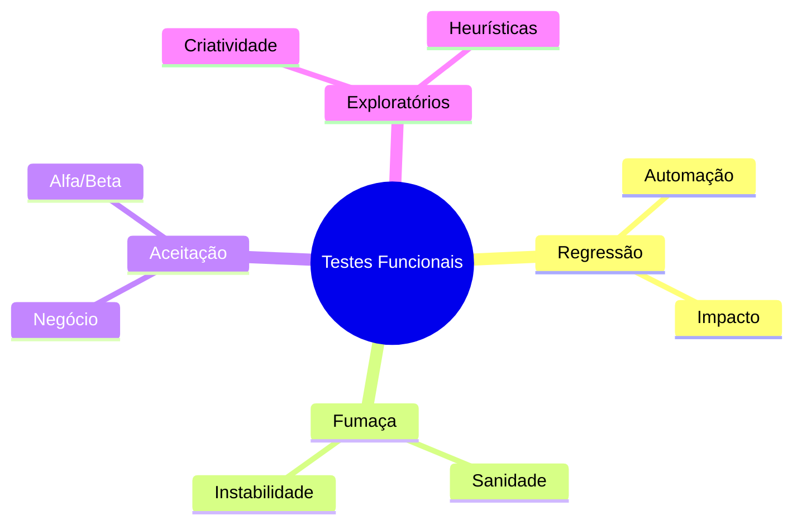

# Aula 09 - Tipos de Testes Funcionais ✅

## 🎭 Classificação dos Testes

Os testes funcionais podem ser classificados de acordo com seu objetivo dentro do ciclo de vida do software.

---

## 🧪 Principais Tipos

### 1. Testes de Regressão
Servem para garantir que uma nova alteração (ou correção de bug) não quebrou funcionalidades que já estavam funcionando.
- **Importante**: São os maiores candidatos para automação.

### 2. Testes de Fumaça (Smoke Test)
Um conjunto mínimo de testes para verificar se as funções básicas do sistema estão operando. Se o Smoke Test falha, o build é rejeitado imediatamente.

### 3. Testes de Aceitação (UAT)
Realizados pelo usuário final ou cliente para validar se o sistema atende às necessidades de negócio antes da entrega oficial.

### 4. Testes Exploratórios
Uma abordagem menos formal onde o testador aprende sobre o sistema, projeta e executa os testes simultaneamente. Baseia-se na experiência e curiosidade do QA.

---

## 💻 Automatizando a Regressão

    pytest tests/regression/
    
    Ran 152 tests in 12.4s
    ✅ All tests passed. Baseline maintains stable.

---

## 📝 Exercício de Fixação

1.  Qual a diferença entre um **Smoke Test** e um **Sanity Test** (Teste de Sanidade)?
2.  Quando é mais indicado utilizar o **Teste Exploratório** ao invés de testes baseados em scripts/casos de teste?

---

## 🚀 Mini-Projeto

**Objetivo**: Planejar um teste de aceitação.
- Imagine um sistema de "Gestão Escolar".
- Escolha uma funcionalidade: "Lançamento de Notas".
- Escreva 3 critérios que o Professor (Usuário Final) usaria para **Aceitar** ou **Rejeitar** essa entrega.
