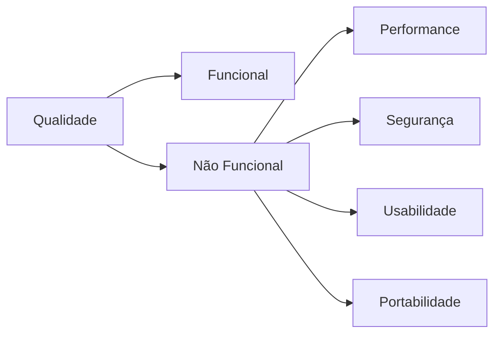

# Aula 10 - Testes Não Funcionais e Usabilidade 🧠

## 🏗️ Além da Funcionalidade

Um software pode fazer exatamente o que foi solicitado, mas ser impossível de usar, lento ou inseguro. É aqui que entram os **Testes Não Funcionais**.

---

## 🧪 Principais Categorias

### 1. Performance, Carga e Estresse
- **Performance**: O quão rápido o sistema responde?
- **Carga**: O sistema aguenta 1.000 usuários simultâneos?
- **Estresse**: O que acontece se o sistema receber 10x mais carga do que o planejado? (Ponto de ruptura).

### 2. Segurança
Verifica vulnerabilidades, permissões de acesso e proteção de dados sensíveis (LGPD).

### 3. Usabilidade e UX (User Experience)
Avalia a facilidade de aprendizado, eficiência de uso e o nível de satisfação do usuário.

---

## 🎨 Conceitos de UX para QAs

Um QA deve se preocupar com as **10 Heurísticas de Nielsen**, como:
- Visibilidade do status do sistema.
- Correspondência entre o sistema e o mundo real.
- Flexibilidade e eficiência de uso.

---

## 💻 Monitorando Resposta de Sistema

    ab -n 100 -c 10 https://api.exemplo.com/v1/search
    
    Requests per second: 15.4 [#/sec] (mean)
    Time per request: 649 ms (mean)
    Atenção: Latência acima do SLA (500ms).

---

## 📝 Exercício de Fixação

1.  Qual a diferença entre um **Teste de Carga** e um **Teste de Estresse**?
2.  Como um problema de usabilidade pode afetar a imagem de uma empresa, mesmo que o sistema não tenha bugs funcionais?

---

## 🚀 Mini-Projeto

**Objetivo**: Auditoria de Usabilidade.
- Escolha um formulário online complexo (ex: cadastro em site oficial).
- Identifique 2 pontos onde a **Heurística de Prevenção de Erros** poderia ser melhor aplicada.
- Sugira uma melhoria para cada ponto.
