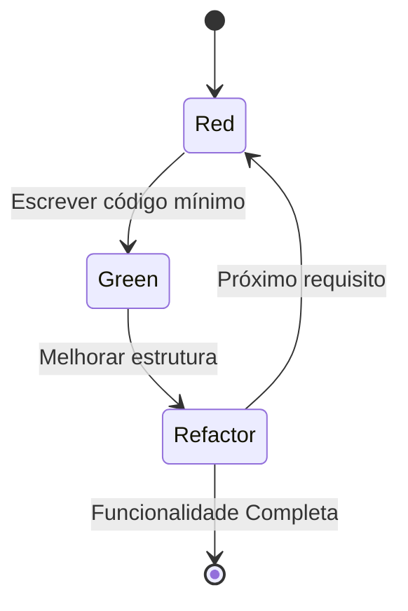

# Aula 11 - Desenvolvimento Orientado por Testes (TDD) 🔴🟢🔵

## 🔄 O Ciclo do TDD

O **TDD (Test Driven Development)** não é apenas uma técnica de teste, mas uma metodologia de design de software. O mantra é: **"Nunca escreva uma linha de código sem antes ter um teste que falhe."**

A metodologia baseia-se em um ciclo curto e repetitivo:

1.  🔴 **RED**: Escreva um teste pequeno que falhe (pois a funcionalidade ainda não existe).
2.  🟢 **GREEN**: Escreva a quantidade mínima de código para fazer o teste passar.
3.  🔵 **REFACTOR**: Melhore o código escrito, removendo duplicidade e aplicando padrões, garantindo que o teste continue passando.

---

## 🧠 Por que usar TDD?

- **Foco no Requisito**: Você só implementa o que é estritamente necessário.
- **Documentação Viva**: Os testes servem como exemplos reais de uso do código.
- **Redução de Bugs**: Problemas de lógica são encontrados instantaneamente.
- **Confiança na Refatoração**: Você pode mudar o código sabendo que os testes te protegem.

---

## 💻 TDD no Terminal

    pytest tests/test_math.py
    FAILED: test_sum_two_numbers not found (RED)
    nano math_utils.py # Implementando def sum(a,b): return a+b
    pytest tests/test_math.py
    PASSED: test_sum_two_numbers (GREEN)
    nano math_utils.py # Refatoração do código

---

## 📝 Exercício de Fixação

1.  No ciclo do TDD, por que é proibido escrever mais código do que o necessário para o teste passar na fase **GREEN**?
2.  Qual a diferença entre um teste escrito **antes** do código (TDD) e um teste escrito **depois** do código pronto?

---

## 🚀 Mini-Projeto

**Objetivo**: Aplicar o ciclo Red-Green-Refactor mentalmente.
- Requisito: Uma função que recebe um nome e retorna "Olá, [Nome]".
- **Passo 1 (Red)**: Como seria a chamada deste teste? Qual seria o erro esperado?
- **Passo 2 (Green)**: Qual o código mínimo para retornar a string correta?
- **Passo 3 (Refactor)**: O que você poderia melhorar se tivesse que tratar nomes vazios?

---

## 🔗 Materiais da Aula

- :material-presentation: **Slides**
    ---
    Material visual com diagramas e conceitos-chave.
    [:octicons-arrow-right-24: Slide 11](../slides/slide-11.html)

- :material-help-circle: **Quiz**
    ---
    Teste seu conhecimento com 10 questões interativas.
    [:octicons-arrow-right-24: Quiz 11](../quizzes/quiz-11.md)

- :fontawesome-solid-pencil: **Exercícios**
    ---
    5 exercícios progressivos (básico → desafio).
    [:octicons-arrow-right-24: Exercício 11](../exercicios/exercicio-11.md)

- :material-briefcase-outline: **Projeto**
    ---
    Aplicação prática dos conceitos da aula.
    [:octicons-arrow-right-24: Projeto 11](../projetos/projeto-11.md)

---

[➡️ Próxima Aula: Aula 12](./aula-12.md){ .md-button .md-button--primary }
