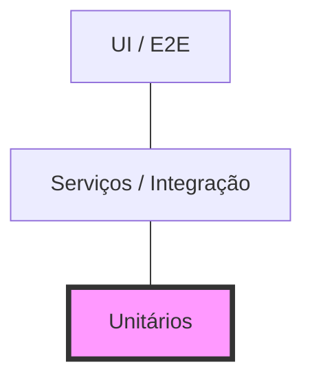

# Aula 12 - Testes Unitários e de Integração 🔗

## 🏗️ A Pirâmide de Testes

A base da qualidade técnica de um sistema reside na proporção correta de tipos de testes automatizados.
- **Unitários**: Testam componentes isolados (funções, classes). Devem ser maioria por serem rápidos e baratos.
- **Integração**: Testam a comunicação entre dois ou mais componentes (ex: app e banco de dados).



---

## 📐 Estrutura AAA (Arrange, Act, Assert)

Um bom teste automatizado deve ser organizado em três etapas claras:

1.  **Arrange (Organizar)**: Configura o cenário, cria os objetos e prepara os dados.
2.  **Act (Agir)**: Executa a ação ou função que se deseja testar.
3.  **Assert (Verificar)**: Valida se o resultado obtido é igual ao esperado.

### Exemplo (Python):
```python
def test_deve_aplicar_desconto():
    # Arrange
    original_price = 100
    expected_price = 90
    
    # Act
    final_price = apply_discount(original_price, 10)
    
    # Assert
    assert final_price == expected_price
```

---

## 🎭 Mocks e Dublês de Teste

Quando um componente depende de algo externo (como uma API de pagamentos ou um Banco de Dados), usamos **Mocks**. O Mock simula o comportamento da dependência, permitindo que o teste unitário continue sendo rápido e independente.

---

## 💻 Monitorando Cobertura Unitária

<div id="termynal" data-termynal>
    <span data-ty="input">pytest --cov=services tests/unit/</span>
    <span data-ty="progress"></span>
    <span data-ty>TOTAL: 85% Cobertura</span>
    <span data-ty="input">pytest tests/integration/</span>
    <span data-ty="progress"></span>
    <span data-ty>3 Failed: Banco de Dados não respondeu (Mock não utilizado!)</span>
</div>

---

## 📝 Exercício de Fixação

1.  Por que não devemos testar o Banco de Dados real em um **Teste Unitário**?
2.  Identifique as fases (Arrange, Act, Assert) em um teste de login que você realizaria manualmente.

---

## 🚀 Mini-Projeto

**Objetivo**: Desenhar um teste de integração.
- Cenário: Uma função que salva um pedido no banco e envia um email de confirmação.
- Como você testaria isso sem enviar um email real para o cliente? 
- Desenhe o fluxo indicando onde entraria um **Mock**.

---

## 🔗 Materiais da Aula

<div class="grid cards" markdown>

- :material-presentation: **Slides**
    ---
    Material visual com diagramas e conceitos-chave.
    [:octicons-arrow-right-24: Slide 12](../slides/slide-12.md)

- :material-help-circle: **Quiz**
    ---
    Teste seu conhecimento com 10 questões interativas.
    [:octicons-arrow-right-24: Quiz 12](../quizzes/quiz-12.md)

- :fontawesome-solid-pencil: **Exercícios**
    ---
    5 exercícios progressivos (básico → desafio).
    [:octicons-arrow-right-24: Exercício 12](../exercicios/exercicio-12.md)

- :material-briefcase-outline: **Projeto**
    ---
    Aplicação prática dos conceitos da aula.
    [:octicons-arrow-right-24: Projeto 12](../projetos/projeto-12.md)

</div>

---

[➡️ Próxima Aula: Aula 13](./aula-13.md){ .md-button .md-button--primary }
