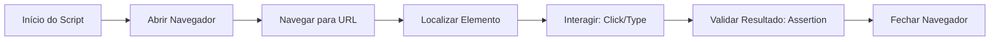

# Aula 13 - Automação de Testes Web 🤖

## 🕸️ Por que automatizar a Web?

A automação de interfaces web (E2E - End-to-End) permite simular a jornada completa do usuário no navegador. Isso reduz drasticamente o tempo de testes de regressão em sistemas complexos.

> [!IMPORTANT]
> A automação web deve focar nos caminhos críticos (Happy Path) do negócio.

---

## 🛠️ Ferramentas Populares

### 1. Selenium WebDriver
O veterano do mercado. Suporta múltiplas linguagens (Python, Java, C#) e navegadores. Baseia-se em um protocolo de comunicação com o driver do browser.

### 2. Playwright / Cypress
Ferramentas modernas que rodam "mais perto" do browser, oferecendo maior velocidade, estabilidade (auto-waiting) e recursos de depuração (Trace Viewer).

---

## 📍 Localizando Elementos (Locators)

Para o script interagir com a página, precisamos "achar" os elementos HTML. As melhores práticas recomendam usar (em ordem de prioridade):
1.  **ID**: `id="submit-button"`
2.  **Name**: `name="email"`
3.  **Data-attributes**: `data-testid="login-btn"` (O favorito dos QAs!)
4.  **CSS Selector** ou **XPath** (Use como última opção).

---

## 💻 Automação no Terminal

    npx playwright test
    
    Running 5 tests using 3 workers
    ✅ [chromium] › login.spec.ts:12:5 › successful login
    ✅ [firefox] › checkout.spec.ts:45:5 › add item to cart
    5 passed (15.2s)

---

## 📝 Exercício de Fixação

1.  O que é **Flakiness** (instabilidade) em testes automatizados e como ferramentas modernas como o Playwright ajudam a evitá-lo?
2.  Por que o uso de `data-testid` é melhor do que usar classes CSS para localizar elementos em um teste?

---

## 🚀 Mini-Projeto

**Objetivo**: Escrever um script fictício (Pseudocódigo).
- Cenário: Validar a busca de produtos no Google.
- Escreva o passo a passo do script:
  1. Qual URL abrir?
  2. Qual o seletor do campo de busca?
  3. O que digitar?
  4. Como validar que a busca funcionou?

---

## 🔗 Materiais da Aula

- :material-presentation: **Slides**
    ---
    Material visual com diagramas e conceitos-chave.
    [:octicons-arrow-right-24: Slide 13](../slides/slide-13.html)

- :material-help-circle: **Quiz**
    ---
    Teste seu conhecimento com 10 questões interativas.
    [:octicons-arrow-right-24: Quiz 13](../quizzes/quiz-13.md)

- :fontawesome-solid-pencil: **Exercícios**
    ---
    5 exercícios progressivos (básico → desafio).
    [:octicons-arrow-right-24: Exercício 13](../exercicios/exercicio-13.md)

- :material-briefcase-outline: **Projeto**
    ---
    Aplicação prática dos conceitos da aula.
    [:octicons-arrow-right-24: Projeto 13](../projetos/projeto-13.md)

---

[➡️ Próxima Aula: Aula 14](./aula-14.md){ .md-button .md-button--primary }
