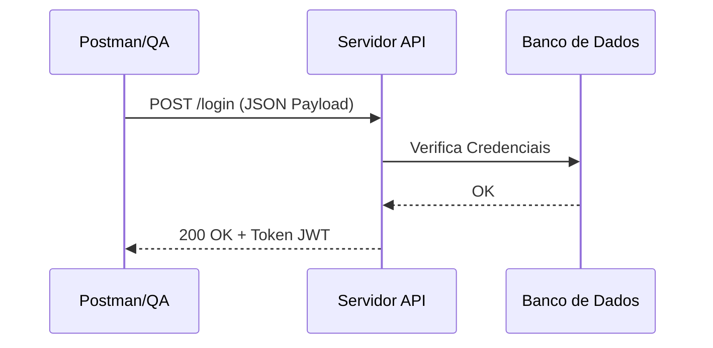

# Aula 14 - Testes de API 📡

## 🔌 O que são APIs?

APIs (Application Programming Interfaces) são pontes que permitem que diferentes sistemas se comuniquem. Atualmente, o padrão **REST** é o mais utilizado em sistemas web e mobile.

Testar a API é testar o "coração" do negócio sem a interferência da interface visual (mais rápido e estável).

---

## 🔑 Conceitos Fundamentais HTTP

### 1. Métodos (Verbos)
- **GET**: Buscar informações.
- **POST**: Criar um novo recurso.
- **PUT/PATCH**: Atualizar informações.
- **DELETE**: Remover um recurso.

### 2. Status Codes
- **2xx (Sucesso)**: Ex: 200 OK, 201 Created.
- **4xx (Erro do Cliente)**: Ex: 400 Bad Request, 401 Unauthorized, 404 Not Found.
- **5xx (Erro do Servidor)**: Ex: 500 Internal Server Error.

---

## 🛠️ Testando com Postman

O Postman é a ferramenta líder para testes de API. Ele permite criar coleções de requisições e automatizar validações usando JavaScript.



---

## 💻 Teste de API via Terminal (cURL)

<div id="termynal" data-termynal>
    <span data-ty="input">curl -X GET https://api.exemplo.com/usuarios/1</span>
    <span data-ty="progress"></span>
    <span data-ty>{ "id": 1, "nome": "Ricardo", "ativo": true }</span>
    <span data-ty="input">newman run colecao_testes.json</span>
    <span data-ty>Finalized: 25 Assertions Passed | 0 Failed</span>
</div>

---

## 📝 Exercício de Fixação

1.  Qual a diferença entre o status code **401** e o **403**?
2.  Por que é considerado "boa prática" testar as APIs antes de testar a interface visual (Frontend)?

---

## 🚀 Mini-Projeto

**Objetivo**: Validar uma resposta JSON.
- Recebemos o seguinte JSON da API:
```json
{
  "status": "sucesso",
  "data": { "valor": 150.00, "moeda": "BRL" }
}
```
- **Tarefa**: Escreva 2 validações que você faria nesta resposta (ex: validar o campo status, validar o valor).

---

## 🔗 Materiais da Aula

<div class="grid cards" markdown>

- :material-presentation: **Slides**
    ---
    Material visual com diagramas e conceitos-chave.
    [:octicons-arrow-right-24: Slide 14](../slides/slide-14.html)

- :material-help-circle: **Quiz**
    ---
    Teste seu conhecimento com 10 questões interativas.
    [:octicons-arrow-right-24: Quiz 14](../quizzes/quiz-14.md)

- :fontawesome-solid-pencil: **Exercícios**
    ---
    5 exercícios progressivos (básico → desafio).
    [:octicons-arrow-right-24: Exercício 14](../exercicios/exercicio-14.md)

- :material-briefcase-outline: **Projeto**
    ---
    Aplicação prática dos conceitos da aula.
    [:octicons-arrow-right-24: Projeto 14](../projetos/projeto-14.md)

</div>

---

[➡️ Próxima Aula: Aula 15](./aula-15.md){ .md-button .md-button--primary }
