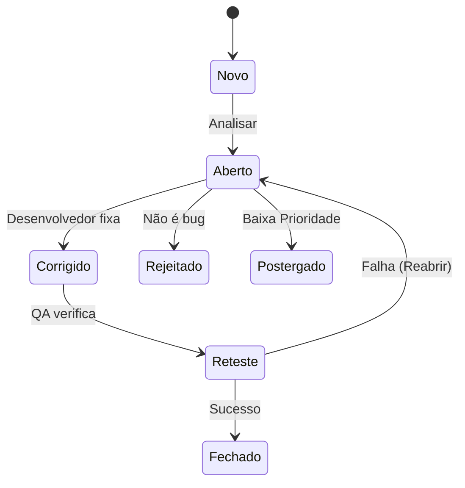

# Aula 15 - Gestão de Defeitos e Ferramentas 🐛

## 📊 O Ciclo de Vida de um Bug

Encontrar um bug é apenas metade do trabalho. A outra metade é garantir que ele seja corrigido, retestado e encerrado. O **Ciclo de Vida do Defeito** define os estados pelos quais um bug passa.

---

## 🛠️ Ferramentas de Gestão (Jira)

O **Jira** é a ferramenta padrão de mercado para gestão ágil e rastreamento de bugs. Através dele, conseguimos:
- Criar **Issues** (tarefas/bugs).
- Definir **Prioridade** (Urgência: Crítica, Alta, Média, Baixa).
- Definir **Severidade** (Impacto técnico: Bloqueante, Crítico, Menor).
- Acompanhar o progresso via **Boards Kanban ou Scrum**.

### Métricas de Acompanhamento
- **Bug Leakage**: Defeitos que escaparam para produção.
- **Bug Open Rate**: Velocidade de descoberta vs. Velocidade de correção.

---

## 💻 Rastreando Bugs no Console

    jira login --email qateam@empresa.com
    jira issue list --project QA --status "In Progress"
    QA-125: Falha no cálculo de frete (Alta)
    jira issue create --title "Página de erro 404 ao salvar perfil"
    ✅ Issue QA-256 criada com sucesso!

---

## 📝 Exercício de Fixação

1.  Qual a diferença entre uma issue **Rejeitada** e uma issue **Postergada**?
2.  Por que é importante anexar **Evidências** (screenshots, logs, vídeos) em um report de bug?

---

## 🚀 Mini-Projeto

**Objetivo**: Simular um Board de Gestão.
- Imagine que você encontrou 3 bugs:
  1. O logotipo está ligeiramente torto.
  2. O banco de dados cai ao processar 10 pedidos.
  3. O botão de "Logout" não funciona.
- **Tarefa**: Classifique cada um por **Severidade** e **Prioridade** e indique qual deve ser corrigido primeiro.

---

## 🔗 Materiais da Aula

- :material-presentation: **Slides**
    ---
    Material visual com diagramas e conceitos-chave.
    [:octicons-arrow-right-24: Slide 15](../slides/slide-15.html)

- :material-help-circle: **Quiz**
    ---
    Teste seu conhecimento com 10 questões interativas.
    [:octicons-arrow-right-24: Quiz 15](../quizzes/quiz-15.md)

- :fontawesome-solid-pencil: **Exercícios**
    ---
    5 exercícios progressivos (básico → desafio).
    [:octicons-arrow-right-24: Exercício 15](../exercicios/exercicio-15.md)

- :material-briefcase-outline: **Projeto**
    ---
    Aplicação prática dos conceitos da aula.
    [:octicons-arrow-right-24: Projeto 15](../projetos/projeto-15.md)

---

[➡️ Próxima Aula: Aula 16](./aula-16.md){ .md-button .md-button--primary }
