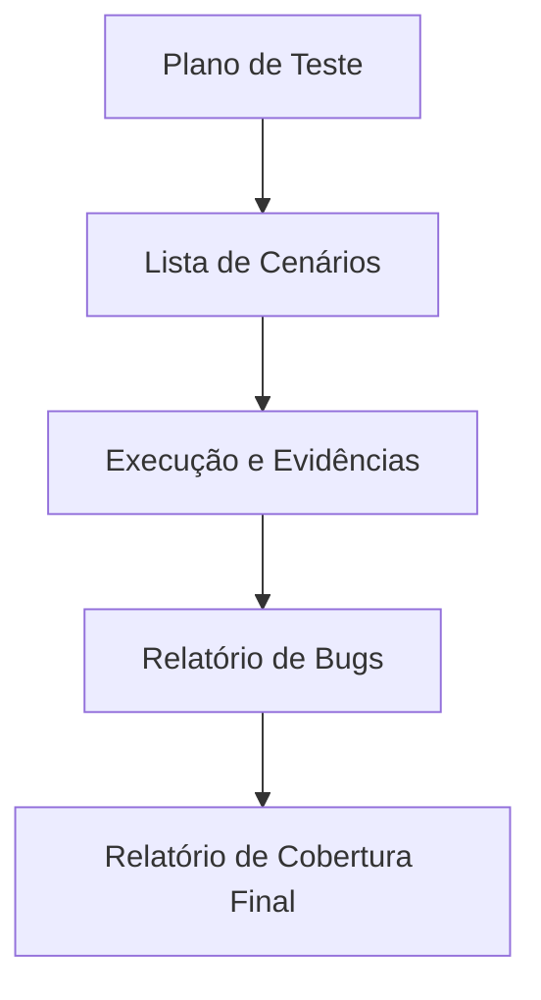

# Aula 16 - Projeto Integrador Final 🎓

## 🏁 O Desafio Final

Chegamos ao final da nossa jornada! Agora é hora de consolidar todo o conhecimento em um projeto prático real. Você assumirá o papel de um **QA Pleno** responsável por garantir a qualidade de uma nova funcionalidade de um sistema.

---

## 📋 Escopo do Projeto

Você deverá testar um módulo de **"Reserva de Vagas de Estacionamento"**.

### Atividades Obrigatórias:

1.  **Planejamento (STLC)**: Defina o escopo e o que será testado.
2.  **Técnicas de Caixa Preta**: Aplique Valor Limite e Partição de Equivalência para o campo "Horas de Reserva" (mínimo 1h, máximo 24h).
3.  **TDD e Testes Unitários**: Escreva (em pseudocódigo ou código real) 2 testes unitários para a regra de cálculo de preço.
4.  **Automação Web**: Escreva o roteiro (ou script) para validar o fluxo de reserva no site.
5.  **Relatório de Defeitos**: Documente pelo menos 1 bug fictício encontrado durante os testes.

---

## 📊 Estrutura de Entrega Esperada

---

## 💻 Simulando a Validação Final

    pytest --version
    ./run-all-tests.sh
    
    Testes Unitários: ✅ PASSED
    Testes de API: ✅ PASSED
    Testes Web (E2E): ✅ PASSED
    Projeto Validado. Parabéns, você é um QA de Sucesso! 🚀

---

## 🏆 Critérios de Avaliação

- **Rigor Técnico**: Uso correto das técnicas de Valor Limite.
- **Organização**: Documentação clara e estruturada.
- **Visão Crítica**: Capacidade de identificar riscos e bugs complexos.
- **Domínio de Ferramentas**: Demonstração de conhecimento em automação.

---

## 📝 Considerações Finais

A área de Qualidade e Testes é dinâmica e fundamental para o sucesso de qualquer empresa de tecnologia. Continue estudando, praticando TDD e explorando novas ferramentas de automação!

**Sucesso na sua carreira em QA!** 🧪✨

---

## 🔗 Materiais da Aula

- :material-presentation: **Slides**
    ---
    Material visual com diagramas e conceitos-chave.
    [:octicons-arrow-right-24: Slide 16](../slides/slide-16.html)

- :material-help-circle: **Quiz**
    ---
    Teste seu conhecimento com 10 questões interativas.
    [:octicons-arrow-right-24: Quiz 16](../quizzes/quiz-16.md)

- :fontawesome-solid-pencil: **Exercícios**
    ---
    5 exercícios progressivos (básico → desafio).
    [:octicons-arrow-right-24: Exercício 16](../exercicios/exercicio-16.md)

- :material-briefcase-outline: **Projeto**
    ---
    Aplicação prática dos conceitos da aula.
    [:octicons-arrow-right-24: Projeto 16](../projetos/projeto-16.md)

---

!!! success "Parabéns!"
    Você concluiu todas as aulas deste curso!

[🏆 Voltar à Trilha de Aulas](./index.md){ .md-button .md-button--primary }
