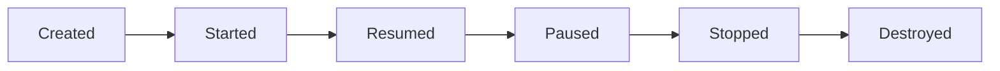

# Aula 04 - Estrutura de um App Android 🏗️
## Manifest, Lifecycle e Layouts

---

## Agenda 📅

1. O Manifesto (Cérebro) { .fragment }
2. Activities e ViewControllers { .fragment }
3. O Ciclo de Vida (Nascer e Morrer) { .fragment }
4. Layouts XML e Recursos (res/) { .fragment }
5. ViewBinding vs findViewById { .fragment }

---

## 1. AndroidManifest.xml 📜

- Identidade do App. { .fragment }
- Permissões (Internet, GPS). { .fragment }
- Lista de Telas (Activities). { .fragment }

---

## 2. Activities: O Cérebro da Tela 🧠

- Herda de `AppCompatActivity`. { .fragment }
- Controla a lógica de uma tela específica. { .fragment }

---

## 3. Ciclo de Vida (Lifecycle) 🔄

Crucial para performance e bateria!



---

## Estados Principais

- **onCreate**: Configuração inicial. { .fragment }
- **onResume**: App visível e pronto para toque. { .fragment }
- **onStop**: App saiu da frente do usuário. { .fragment }

---

## Activity vs UIViewController

- Mesma lógica de gerenciar estados e visual. { .fragment }

| Android 🤖 | iOS 🍎 |
| :--- | :--- |
| `onCreate` | `viewDidLoad` |
| `onStart` | `viewWillAppear` |
| `onStop` | `viewDidDisappear` |

---

## 4. Layouts XML 🎨

- O visual é separado da lógica. { .fragment }
- Arquivos em `res/layout`. { .fragment }

```xml
<TextView
    android:layout_width="wrap_content"
    android:layout_height="wrap_content"
    android:text="Olá Mundo" />
```

---

## 5. Recursos (res/) 📦

- **drawable**: Imagens. { .fragment }
- **values/strings**: Textos traduzíveis. { .fragment }
- **values/colors**: Paleta de cores. { .fragment }

---

## 6. ViewBinding 🔗

- A forma moderna e segura de acessar a UI. { .fragment }

```kotlin
// Antes (Perigoso)
val btn = findViewById<Button>(R.id.btn)

// Depois (Seguro)
binding.btnClick.setOnClickListener { ... }
```

---

## Desafio: O App sumiu! 😱

Se o usuário aperta o botão HOME, qual método do ciclo de vida é o último a ser chamado com certeza?

---

## Resumo ✅

- Manifest é a configuração. { .fragment }
- Activity gerencia a tela. { .fragment }
- Ciclo de vida evita travamentos e gasto de bateria. { .fragment }
- XML desenha, Kotlin controla. { .fragment }

---

## Próxima Aula: Interfaces (UI) 🎨

- ConstraintLayout. { .fragment }
- Componentes Modernos. { .fragment }
- Eventos de Clique. { .fragment }

---

## Dúvidas? 🏗️