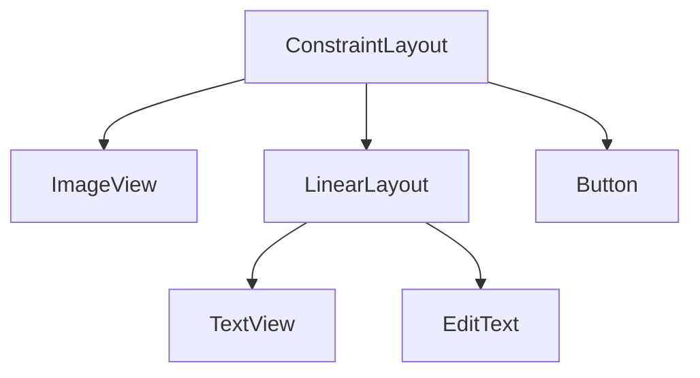

# Aula 05 - Interface Gráfica (UI) 🎨
## Desenhando apps profissionais

---

## Agenda 📅

1. Views e ViewGroups { .fragment }
2. Unidades: dp vs sp { .fragment }
3. LinearLayout e FrameLayout { .fragment }
4. O Poder do ConstraintLayout { .fragment }
5. Temas e Estilos { .fragment }

---

## 1. O que é uma View? 🧱

- Todo componente visual é uma classe que herda de `View`. { .fragment }
- **TextView**: Texto. { .fragment }
- **ImageView**: Imagem. { .fragment }
- **Button**: Botão. { .fragment }

---

## 2. O que é um ViewGroup? 📦

- É um container que organiza as Views. { .fragment }
- Também é conhecido como **Layout**. { .fragment }

---

## Hierarquia de UI



---

## 3. Unidades de Medida 📏

- **dp (Density-independent Pixels)**: Use para tamanhos e margens. { .fragment }
- **sp (Scale-independent Pixels)**: Use para textos. { .fragment }

> **Dica**: 16dp é a margem padrão recomendada pelo Material Design.

---

## 4. LinearLayout 📏

- Organiza em fila. { .fragment }
- **Vertical**: Um embaixo do outro. { .fragment }
- **Horizontal**: Um ao lado do outro. { .fragment }
- **Weight**: Distribui o espaço proporcionalmente. { .fragment }

---

## 5. ConstraintLayout 💪

- O rei dos layouts no Android. { .fragment }
- Evita o aninhamento excessivo. { .fragment }
- Usa "amarras" (constraints) para posicionar. { .fragment }

```xml
app:layout_constraintTop_toTopOf="parent"
app:layout_constraintStart_toStartOf="parent"
```

---

## 6. Temas e Estilos 💅

- Evite repetir atributos (cor, tamanho) em cada View. { .fragment }
- Use a pasta `res/values/themes.xml`. { .fragment }

---

## 7. Eventos de Clique 🖱️

- A View notifica o código quando é tocada. { .fragment }

```kotlin
binding.myButton.setOnClickListener {
    // Ação aqui
}
```

---

## Desafio Visual ⚡

Qual layout você usaria para colocar uma legenda em cima de uma foto? (Empilhamento)

---

## Resumo ✅

- Views são os átomos, Layouts são as moléculas. { .fragment }
- Use `dp` e `sp` sempre. { .fragment }
- ConstraintLayout é mais performático. { .fragment }
- Separe estilo de estrutura. { .fragment }

---

## Próxima Aula: Navegação 🗺️

- Como ir de uma tela para outra. { .fragment }
- Passagem de dados. { .fragment }

---

## Dúvidas? 🤔