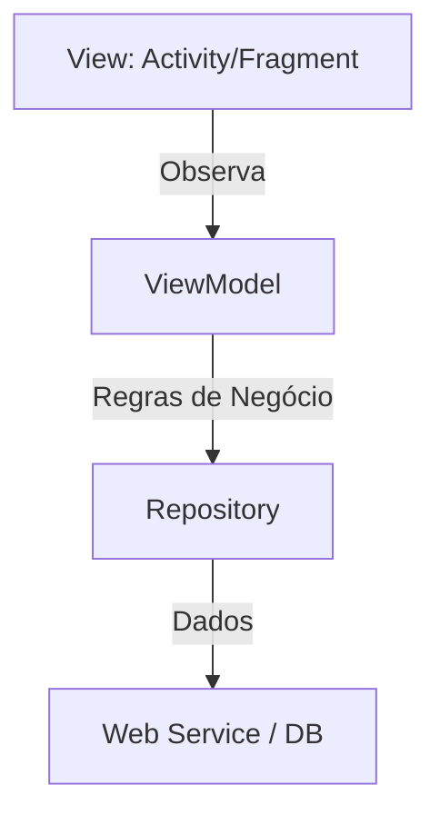

# Aula 07 - Arquitetura MVVM 🏗️
## Desenvolvendo para escalar

---

## Agenda 📅

1. O Caos da "God Activity" { .fragment }
2. Model-View-ViewModel { .fragment }
3. LiveData e ciclo de vida { .fragment }
4. O Poder da Reatividade { .fragment }
5. Rotação de Tela e Persistência de Estado { .fragment }

---

## 1. Por que Arquitetura? 🤔

- Evita código "espaguete". { .fragment }
- Facilita testes automatizados (essencial para devs sênior). { .fragment }
- Separa lógica de UI (facilitando o trabalho com designers). { .fragment }

---

## 2. Camadas do MVVM 📐



---

## 2.1 View (O Rosto)

- XML e a Activity que infla o binding. { .fragment }
- **Regra**: Ela não deve ter lógica de cálculo ou dados. { .fragment }

---

## 2.2 ViewModel (O Cérebro)

- Guarda os dados que a View precisa. { .fragment }
- Sobrevive à rotação de tela. { .fragment }

---

## 2.3 Model (O Coração)

- Classes de dados (Data Classes). { .fragment }
- Repositórios. { .fragment }

---

## 3. LiveData 📡

- É um "caixa eletrônico" de dados. { .fragment }
- A View se inscreve para receber atualizações. { .fragment }

```kotlin
val count = MutableLiveData<Int>()
count.observe(this) { valor -> 
    binding.txt.text = valor.toString() 
}
```

---

## 4. Reatividade 🔄

- Em vez de mandar a UI mudar, o dado muda e a UI reage. { .fragment }

---

## 5. Gire o Celular! 🔄

- A Activity é destruída. { .fragment }
- O ViewModel resiste bravamente. { .fragment }
- Quando a Activity volta, ela "reconecta" no dado. { .fragment }

---

## Desafio MVVM ⚡

Onde você colocaria a lógica de validar se um E-mail é válido? Na Activity ou no ViewModel?

---

## Resumo ✅

- MVVM separa responsabilidades. { .fragment }
- LiveData é consciente do ciclo de vida. { .fragment }
- Evita perda de dados em mudança de configuração. { .fragment }

---

## Próxima Aula: Persistência (Room) 💾

- Salvando dados no banco interno. { .fragment }
- SQLite facilitado. { .fragment }

---

## Dúvidas? 🏗️