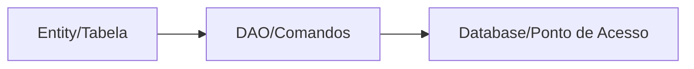

# Aula 08 - Persistência de Dados 💾
## Guardando informações para sempre

---

## Agenda 📅

1. SharedPreferences (Preferências) { .fragment }
2. Introdução ao SQLite { .fragment }
3. A Biblioteca Room (Jetpack) { .fragment }
4. Entities, DAOs e Database { .fragment }
5. Operações Assíncronas (Threads) { .fragment }

---

## 1. Onde Guardar? 📦

- **Leve (Configurações)**: SharedPreferences. { .fragment }
- **Estruturado (Listas/Produtos)**: Room/SQLite. { .fragment }
- **Arquivos (Fotos/PDFs)**: Internal/External Storage. { .fragment }

---

## 2. SharedPreferences 🔑

- Sistema de Chave-Valor. { .fragment }

```kotlin
val prefs = getSharedPreferences("config", MODE_PRIVATE)
prefs.edit().putBoolean("dark_mode", true).apply()
```

---

## 3. O Mundo Room 🏛️

- O Google nos deu um ORM (Object-Relational Mapping). { .fragment }
- Transforma classes em tabelas SQL automaticamente. { .fragment }

---

## Componentes do Room

1.  **Entity**: A classe marcada com `@Entity`. { .fragment }
2.  **DAO**: Interface com `@Insert`, `@Query`. { .fragment }
3.  **Database**: A classe abstrata que conecta tudo. { .fragment }



---

## 4. O perigo da UI Thread 🧵

- O Android proíbe acessar banco na thread principal. { .fragment }
- Se você fizer `dao.insert(item)` na Main Thread, o App cai! { .fragment }
- Solução: Coroutines (que veremos à frente). { .fragment }

---

## 5. Comparativo: Persistência iOS 🆚

| Android 🤖 | iOS 🍎 |
| :--- | :--- |
| SharedPreferences | UserDefaults |
| Room (SQLite) | SwiftData / Core Data |
| Internal Storage | App Sandbox |

---

## 7. Melhores Práticas 🏆

- Nunca guarde senhas em texto puro! { .fragment }
- Use LiveData/Flow para o banco atualizar a tela sozinho. { .fragment }
- Mantenha o Schema do banco organizado. { .fragment }

---

## Desafio de Persistência ⚡

Se eu desinstalar o app, os dados gravados no SharedPreferences continuam lá?

---

## Resumo ✅

- SharedPreferences para o simples. { .fragment }
- Room para o complexo e estruturado. { .fragment }
- Sempre rode banco fora da thread principal. { .fragment }

---

## Próxima Aula: RecyclerView 📋

- Exibindo listas gigantes de forma eficiente. { .fragment }
- Ciclo de vida de células. { .fragment }

---

## Dúvidas? 💾