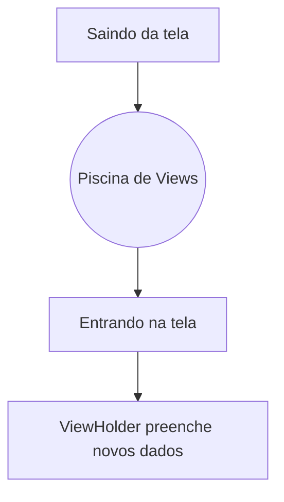

# Aula 09 - Listas Eficientes (RecyclerView) 📋
## Performance em listas infinitas

---

## Agenda 📅

1. O Problema da ListView 🐢 { .fragment }
2. O Conceito de Reciclagem ♻️ { .fragment }
3. ViewHolder e Adapter { .fragment }
4. LayoutManagers { .fragment }
5. Cliques e Interação { .fragment }

---

## 1. Por que Reciclar? 🤔

- Criar mil layouts trava o celular. { .fragment }
- O RecyclerView reaproveita a carcaça da View. { .fragment }
- **Fato**: Apenas o que cabe na tela existe de verdade. { .fragment }

---

## 2. A Reciclagem Visual ♻️



---

## 3. Os 3 Componentes Reais ⚙️

1.  **LayoutManager**: "Como eu organizo?" (Lista/Grade) { .fragment }
2.  **Adapter**: "Quais dados eu coloco?" { .fragment }
3.  **ViewHolder**: "Onde eu guardo as referências?" { .fragment }

---

## 4. O Adapter na Prática ⚔️

```kotlin
override fun onBindViewHolder(holder: ViewHolder, position: Int) {
    val item = lista[position]
    holder.txtNome.text = item.nome
}
```

---

## 5. LayoutManagers: Formatos 🤸

- **LinearLayoutManager**: Lista vertical. { .fragment }
- **GridLayoutManager**: Grade (estilo galeria). { .fragment }
- **Staggered**: Grade irregular (estilo Pinterest). { .fragment }

---

## 6. Cliques no Item 👆

- Passe uma lambda (callback) para o Adapter. { .fragment }
- Use a posição (`position`) do item clicado. { .fragment }

---

## 7. Melhores Práticas 🏆

- Use **ListAdapter** + **DiffUtil**. { .fragment }
- Evite lógica pesada dentro do `onBind`. { .fragment }
- Ícones de placeholders para imagens. { .fragment }

---

## Desafio de Lista ⚡

Qual o comando no iOS que faz o mesmo que a reciclagem do Android?

---

## Resumo ✅

- RecyclerView = Performance. { .fragment }
- Adapter liga dado e visual. { .fragment }
- ViewHolder evita o `findViewById` excessivo. { .fragment }

---

## Próxima Aula: API REST 🌍

- Trazendo dados da nuvem. { .fragment }
- Retrofit e JSON. { .fragment }

---

## Dúvidas? 📋