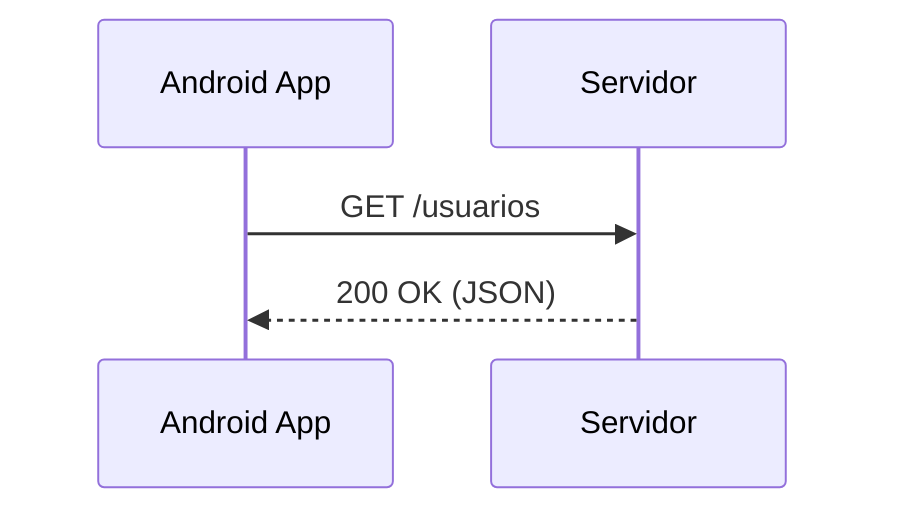

# Aula 10 - Consumindo API REST 🌍
## Conectando seu app ao mundo

---

## Agenda 📅

1. O que é uma API? { .fragment }
2. Formato JSON { .fragment }
3. Retrofit e GSON { .fragment }
4. Permissões de Internet { .fragment }
5. Autenticação (Tokens) { .fragment }

---

## 1. Request & Response 📨



---

## 2. O Formato JSON 📦

```json
{
  "id": 1,
  "nome": "Ricardo",
  "cargo": "Dev Android"
}
```

---

## 3. Retrofit: O Rei das APIs 🚀

- Converte o site em uma interface de código. { .fragment }
- Automatiza a conversão de JSON para Objeto. { .fragment }

```kotlin
@GET("repos")
suspend fun getRepos(): List<Repo>
```

---

## 4. Permissões 🛡️

- Sem `android.permission.INTERNET`, nada acontece. { .fragment }
- Adicione no `AndroidManifest.xml`. { .fragment }

---

## 5. Autenticação 🔐

- **Headers**: Onde enviamos o Token. { .fragment }
- Padrão **Bearer Token**. { .fragment }

---

## 6. Boas Práticas 🏆

- Nunca rode API na Thread Principal. { .fragment }
- Use `viewModelScope`. { .fragment }
- Trate os erros (404, 500, Offline). { .fragment }

---

## Desafio de Rede ⚡

Qual biblioteca do iOS é a mais famosa concorrente do Retrofit?

---

## Resumo ✅

- APIs retornam JSON. { .fragment }
- Retrofit é a ferramenta padrão. { .fragment }
- Permissão de internet é vital. { .fragment }

---

## Próxima Aula: Threads e Async 🧵

- Como não travar a tela durante o download. { .fragment }

---

## Dúvidas? 🌍