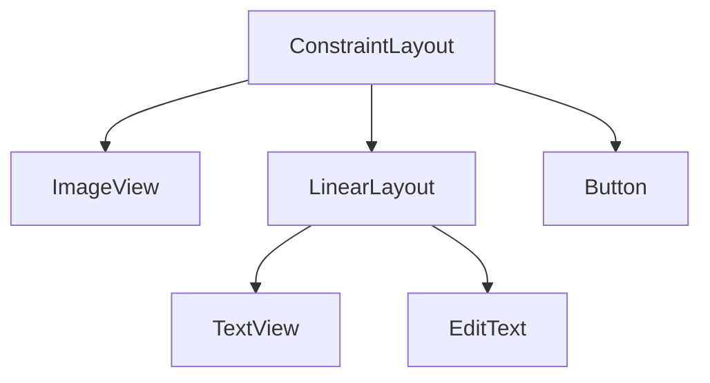

# Aula 05 - Interface Gráfica (UI) 🎨
## Desenhando apps profissionais

---

## Agenda 📅

1. Views e ViewGroups <!-- .element: class="fragment" -->
2. Unidades: dp vs sp <!-- .element: class="fragment" -->
3. LinearLayout e FrameLayout <!-- .element: class="fragment" -->
4. O Poder do ConstraintLayout <!-- .element: class="fragment" -->
5. Temas e Estilos <!-- .element: class="fragment" -->

---

## 1. O que é uma View? 🧱

- Todo componente visual é uma classe que herda de `View`. <!-- .element: class="fragment" -->
- **TextView**: Texto. <!-- .element: class="fragment" -->
- **ImageView**: Imagem. <!-- .element: class="fragment" -->
- **Button**: Botão. <!-- .element: class="fragment" -->

---

## 2. O que é um ViewGroup? 📦

- É um container que organiza as Views. <!-- .element: class="fragment" -->
- Também é conhecido como **Layout**. <!-- .element: class="fragment" -->

---

## Hierarquia de UI



---

## 3. Unidades de Medida 📏

- **dp (Density-independent Pixels)**: Use para tamanhos e margens. <!-- .element: class="fragment" -->
- **sp (Scale-independent Pixels)**: Use para textos. <!-- .element: class="fragment" -->

> **Dica**: 16dp é a margem padrão recomendada pelo Material Design.

---

## 4. LinearLayout 📏

- Organiza em fila. <!-- .element: class="fragment" -->
- **Vertical**: Um embaixo do outro. <!-- .element: class="fragment" -->
- **Horizontal**: Um ao lado do outro. <!-- .element: class="fragment" -->
- **Weight**: Distribui o espaço proporcionalmente. <!-- .element: class="fragment" -->

---

## 5. ConstraintLayout 💪

- O rei dos layouts no Android. <!-- .element: class="fragment" -->
- Evita o aninhamento excessivo. <!-- .element: class="fragment" -->
- Usa "amarras" (constraints) para posicionar. <!-- .element: class="fragment" -->

```xml
app:layout_constraintTop_toTopOf="parent"
app:layout_constraintStart_toStartOf="parent"
```

---

## 6. Temas e Estilos 💅

- Evite repetir atributos (cor, tamanho) em cada View. <!-- .element: class="fragment" -->
- Use a pasta `res/values/themes.xml`. <!-- .element: class="fragment" -->

---

## 7. Eventos de Clique 🖱️

- A View notifica o código quando é tocada. <!-- .element: class="fragment" -->

```kotlin
binding.myButton.setOnClickListener {
    // Ação aqui
}
```

---

## Desafio Visual ⚡

Qual layout você usaria para colocar uma legenda em cima de uma foto? (Empilhamento)

---

## Resumo ✅

- Views são os átomos, Layouts são as moléculas. <!-- .element: class="fragment" -->
- Use `dp` e `sp` sempre. <!-- .element: class="fragment" -->
- ConstraintLayout é mais performático. <!-- .element: class="fragment" -->
- Separe estilo de estrutura. <!-- .element: class="fragment" -->

---

## Próxima Aula: Navegação 🗺️

- Como ir de uma tela para outra. <!-- .element: class="fragment" -->
- Passagem de dados. <!-- .element: class="fragment" -->

---

## Dúvidas? 🤔