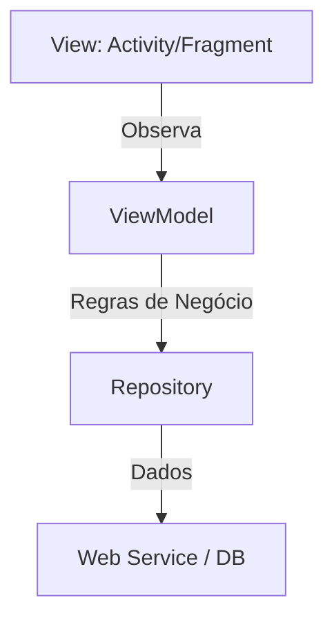

# Aula 07 - Arquitetura MVVM 🏗️
## Desenvolvendo para escalar

---

## Agenda 📅

1. O Caos da "God Activity" <!-- .element: class="fragment" -->
2. Model-View-ViewModel <!-- .element: class="fragment" -->
3. LiveData e ciclo de vida <!-- .element: class="fragment" -->
4. O Poder da Reatividade <!-- .element: class="fragment" -->
5. Rotação de Tela e Persistência de Estado <!-- .element: class="fragment" -->

---

## 1. Por que Arquitetura? 🤔

- Evita código "espaguete". <!-- .element: class="fragment" -->
- Facilita testes automatizados (essencial para devs sênior). <!-- .element: class="fragment" -->
- Separa lógica de UI (facilitando o trabalho com designers). <!-- .element: class="fragment" -->

---

## 2. Camadas do MVVM 📐



---

## 2.1 View (O Rosto)

- XML e a Activity que infla o binding. <!-- .element: class="fragment" -->
- **Regra**: Ela não deve ter lógica de cálculo ou dados. <!-- .element: class="fragment" -->

---

## 2.2 ViewModel (O Cérebro)

- Guarda os dados que a View precisa. <!-- .element: class="fragment" -->
- Sobrevive à rotação de tela. <!-- .element: class="fragment" -->

---

## 2.3 Model (O Coração)

- Classes de dados (Data Classes). <!-- .element: class="fragment" -->
- Repositórios. <!-- .element: class="fragment" -->

---

## 3. LiveData 📡

- É um "caixa eletrônico" de dados. <!-- .element: class="fragment" -->
- A View se inscreve para receber atualizações. <!-- .element: class="fragment" -->

```kotlin
val count = MutableLiveData<Int>()
count.observe(this) { valor -> 
    binding.txt.text = valor.toString() 
}
```

---

## 4. Reatividade 🔄

- Em vez de mandar a UI mudar, o dado muda e a UI reage. <!-- .element: class="fragment" -->

---

## 5. Gire o Celular! 🔄

- A Activity é destruída. <!-- .element: class="fragment" -->
- O ViewModel resiste bravamente. <!-- .element: class="fragment" -->
- Quando a Activity volta, ela "reconecta" no dado. <!-- .element: class="fragment" -->

---

## Desafio MVVM ⚡

Onde você colocaria a lógica de validar se um E-mail é válido? Na Activity ou no ViewModel?

---

## Resumo ✅

- MVVM separa responsabilidades. <!-- .element: class="fragment" -->
- LiveData é consciente do ciclo de vida. <!-- .element: class="fragment" -->
- Evita perda de dados em mudança de configuração. <!-- .element: class="fragment" -->

---

## Próxima Aula: Persistência (Room) 💾

- Salvando dados no banco interno. <!-- .element: class="fragment" -->
- SQLite facilitado. <!-- .element: class="fragment" -->

---

## Dúvidas? 🏗️