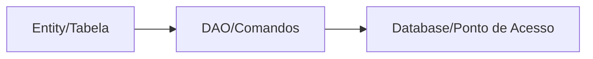

# Aula 08 - Persistência de Dados 💾
## Guardando informações para sempre

---

## Agenda 📅

1. SharedPreferences (Preferências) <!-- .element: class="fragment" -->
2. Introdução ao SQLite <!-- .element: class="fragment" -->
3. A Biblioteca Room (Jetpack) <!-- .element: class="fragment" -->
4. Entities, DAOs e Database <!-- .element: class="fragment" -->
5. Operações Assíncronas (Threads) <!-- .element: class="fragment" -->

---

## 1. Onde Guardar? 📦

- **Leve (Configurações)**: SharedPreferences. <!-- .element: class="fragment" -->
- **Estruturado (Listas/Produtos)**: Room/SQLite. <!-- .element: class="fragment" -->
- **Arquivos (Fotos/PDFs)**: Internal/External Storage. <!-- .element: class="fragment" -->

---

## 2. SharedPreferences 🔑

- Sistema de Chave-Valor. <!-- .element: class="fragment" -->

```kotlin
val prefs = getSharedPreferences("config", MODE_PRIVATE)
prefs.edit().putBoolean("dark_mode", true).apply()
```

---

## 3. O Mundo Room 🏛️

- O Google nos deu um ORM (Object-Relational Mapping). <!-- .element: class="fragment" -->
- Transforma classes em tabelas SQL automaticamente. <!-- .element: class="fragment" -->

---

## Componentes do Room

1.  **Entity**: A classe marcada com `@Entity`. <!-- .element: class="fragment" -->
2.  **DAO**: Interface com `@Insert`, `@Query`. <!-- .element: class="fragment" -->
3.  **Database**: A classe abstrata que conecta tudo. <!-- .element: class="fragment" -->



---

## 4. O perigo da UI Thread 🧵

- O Android proíbe acessar banco na thread principal. <!-- .element: class="fragment" -->
- Se você fizer `dao.insert(item)` na Main Thread, o App cai! <!-- .element: class="fragment" -->
- Solução: Coroutines (que veremos à frente). <!-- .element: class="fragment" -->

---

## 5. Comparativo: Persistência iOS 🆚

| Android 🤖 | iOS 🍎 |
| :--- | :--- |
| SharedPreferences | UserDefaults |
| Room (SQLite) | SwiftData / Core Data |
| Internal Storage | App Sandbox |

---

## 7. Melhores Práticas 🏆

- Nunca guarde senhas em texto puro! <!-- .element: class="fragment" -->
- Use LiveData/Flow para o banco atualizar a tela sozinho. <!-- .element: class="fragment" -->
- Mantenha o Schema do banco organizado. <!-- .element: class="fragment" -->

---

## Desafio de Persistência ⚡

Se eu desinstalar o app, os dados gravados no SharedPreferences continuam lá?

---

## Resumo ✅

- SharedPreferences para o simples. <!-- .element: class="fragment" -->
- Room para o complexo e estruturado. <!-- .element: class="fragment" -->
- Sempre rode banco fora da thread principal. <!-- .element: class="fragment" -->

---

## Próxima Aula: RecyclerView 📋

- Exibindo listas gigantes de forma eficiente. <!-- .element: class="fragment" -->
- Ciclo de vida de células. <!-- .element: class="fragment" -->

---

## Dúvidas? 💾