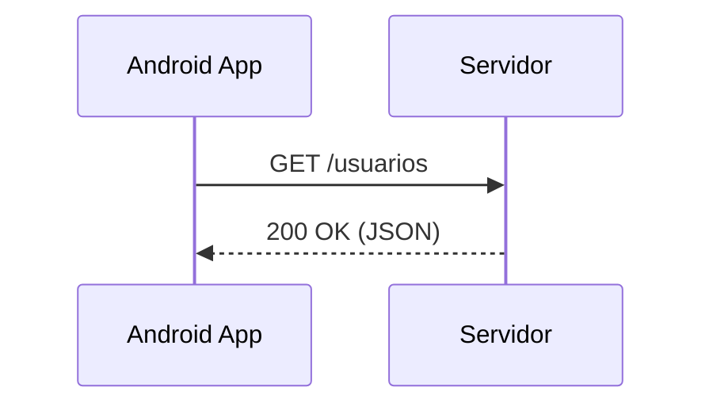

# Aula 10 - Consumindo API REST 🌍
## Conectando seu app ao mundo

---

## Agenda 📅

1. O que é uma API? <!-- .element: class="fragment" -->
2. Formato JSON <!-- .element: class="fragment" -->
3. Retrofit e GSON <!-- .element: class="fragment" -->
4. Permissões de Internet <!-- .element: class="fragment" -->
5. Autenticação (Tokens) <!-- .element: class="fragment" -->

---

## 1. Request & Response 📨



---

## 2. O Formato JSON 📦

```json
{
  "id": 1,
  "nome": "Ricardo",
  "cargo": "Dev Android"
}
```

---

## 3. Retrofit: O Rei das APIs 🚀

- Converte o site em uma interface de código. <!-- .element: class="fragment" -->
- Automatiza a conversão de JSON para Objeto. <!-- .element: class="fragment" -->

```kotlin
@GET("repos")
suspend fun getRepos(): List<Repo>
```

---

## 4. Permissões 🛡️

- Sem `android.permission.INTERNET`, nada acontece. <!-- .element: class="fragment" -->
- Adicione no `AndroidManifest.xml`. <!-- .element: class="fragment" -->

---

## 5. Autenticação 🔐

- **Headers**: Onde enviamos o Token. <!-- .element: class="fragment" -->
- Padrão **Bearer Token**. <!-- .element: class="fragment" -->

---

## 6. Boas Práticas 🏆

- Nunca rode API na Thread Principal. <!-- .element: class="fragment" -->
- Use `viewModelScope`. <!-- .element: class="fragment" -->
- Trate os erros (404, 500, Offline). <!-- .element: class="fragment" -->

---

## Desafio de Rede ⚡

Qual biblioteca do iOS é a mais famosa concorrente do Retrofit?

---

## Resumo ✅

- APIs retornam JSON. <!-- .element: class="fragment" -->
- Retrofit é a ferramenta padrão. <!-- .element: class="fragment" -->
- Permissão de internet é vital. <!-- .element: class="fragment" -->

---

## Próxima Aula: Threads e Async 🧵

- Como não travar a tela durante o download. <!-- .element: class="fragment" -->

---

## Dúvidas? 🌍