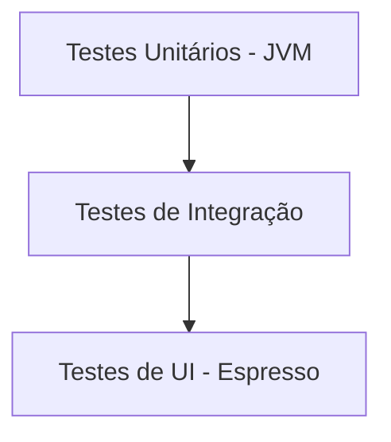

# Aula 14 - Testes e Qualidade 🐞
## Desenvolvendo com confiança

---

## Agenda 📅

1. Logcat e Debugging <!-- .element: class="fragment" -->
2. Breakpoints 🛑 <!-- .element: class="fragment" -->
3. Pirâmide de Testes <!-- .element: class="fragment" -->
4. Testes Unitários <!-- .element: class="fragment" -->
5. Testes de UI (Espresso) <!-- .element: class="fragment" -->

---

## 1. Logcat 📝

- Pare de usar `println`. <!-- .element: class="fragment" -->
- Use `Log.d`, `Log.e`, `Log.i`. <!-- .element: class="fragment" -->
- Filtros por TAG facilitam o trabalho. <!-- .element: class="fragment" -->

---

## 2. O Poder do Debugger 🛠️

- **Breakpoint**: Congela o app no tempo. <!-- .element: class="fragment" -->
- Inspecione variáveis sem precisar de logs. <!-- .element: class="fragment" -->
- "Step over" e "Step into". <!-- .element: class="fragment" -->

---

## 3. Tipos de Testes 🧪



- **Unitários**: Rápidos e isolados. <!-- .element: class="fragment" -->
- **UI**: Lentos, mas testam a experiência real. <!-- .element: class="fragment" -->

---

## 4. Testes Unitários ⚙️

- Testam sua lógica (ViewModel/Business Rules). <!-- .element: class="fragment" -->
- Rode direto no Mac/PC (sem emulador). <!-- .element: class="fragment" -->

---

## 5. Expresso ☕

- Ele "clica" por você. <!-- .element: class="fragment" -->
- Automatiza fluxos chatos (ex: teste de login). <!-- .element: class="fragment" -->

```kotlin
onView(withId(R.id.btn)).perform(click())
```

---

## 6. Erros Comuns no Android ⚠️

- **NullPointerException**: O clássico. <!-- .element: class="fragment" -->
- **ActivityNotFound**: Esqueceu de por no Manifest? <!-- .element: class="fragment" -->
- **CalledFromWrongThread**: Mexeu na UI fora da Main Thread. <!-- .element: class="fragment" -->

---

## 7. Boas Práticas 🏆

- Use `try/catch` para zonas de perigo (IO/Rede). <!-- .element: class="fragment" -->
- Mostre mensagens amigáveis para o usuário. <!-- .element: class="fragment" -->

---

## Desafio de Debug ⚡

Qual comando você usa para ver mensagens apenas de ERRO no Logcat?

---

## Resumo ✅

- Logcat é o seu diário. <!-- .element: class="fragment" -->
- Debugger é sua lupa. <!-- .element: class="fragment" -->
- Testes Automáticos são sua proteção. <!-- .element: class="fragment" -->

---

## Próxima Aula: Publicação 🚀

- Hora de ganhar o mundo na Play Store. <!-- .element: class="fragment" -->

---

## Dúvidas? 🐞